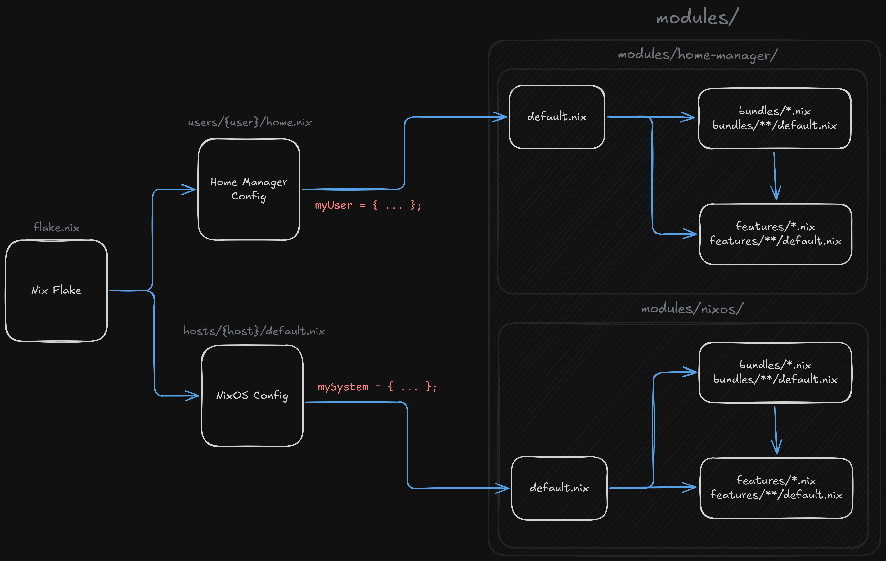

<h1 align="center">NixOS Modular Configuration</h1>

## Table of Contents
- [Todo List](#todo-list)
- [Configuration Architecture](#configuration-architecture)

## Todo List
- [ ] Create own custom Nixvim config (remove Neve)
- [ ] Configure Hyprland
- [X] Configure Rofi
- [ ] Modularize user settings (e.g. terminal choice)
- [ ] Create host for desktop
- [ ] Declare general dots
- [ ] Configure secrets store?
- [ ] Modularize Catppuccin and themes
- TBD...

## Configuration Architecture

    

